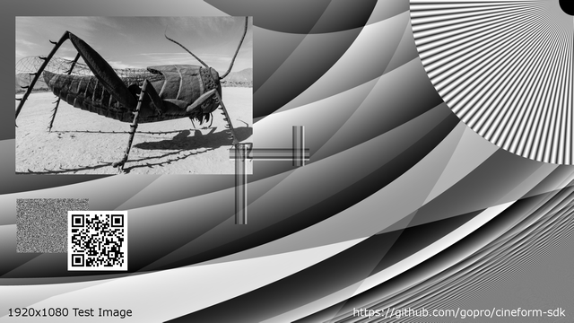
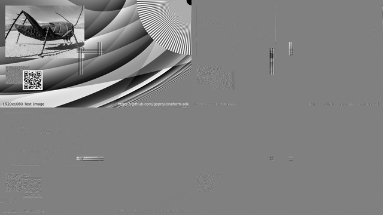
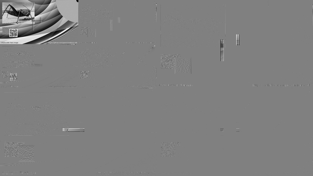
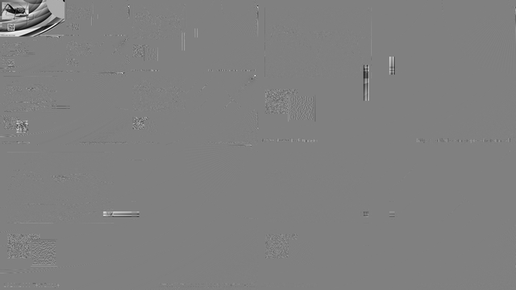

# CineForm Introduction

CineForm is a 12-bit, full-frame wavelet compression video codec. It is designed for speed and quality, at the expense of a very high compression size. Image compression is a balance of size, speed and quality, and you can only choose two. CineForm was the first of its type to focus on speed, while supporting higher bit depths for image quality. More recent examples would be Avid DNxHD and Apple ProRES, although both divide the image into blocks using DCT.  The full frame wavelet as a subject quality advantage over DCTs, so you can compression more without classic ringing or block artifact issues. 

Pixel formats supported:
* 8/10/16-bit YUV 4:2:2 compressed as 10-bit, progressive or interlace 
* 8/10/16-bit RGB 4:4:4 compressed at 12-bit progressive
* 8/16-bit RGBA 4:4:4:4 compressed at 12-bit progressive
* 12/16-bit CFA Bayer RAW, log encoded and compressed at 12-bit progressive
* Dual channel stereoscopic/3D in any of the above.

Compression ratio: between 10:1 and 4:1 are typical, greater ranges are possible. CineForm is a constant quality design, bit-rates will vary as needed for the scene. Whereas most other intermediate video codecs are a constant bit-rate design, quality varies depending on the scene.  

# Included Within This Repository

* The complete source to CineForm Encoder and Decoder SDK. C and C++ with hand-optimized SSE2 intrinsics for x86/x64 platforms, with cross platform threading.
* TestCFHD - demo code for using the encoder and decoder SDKs as a guide to adding CineForm to your applications.
* WaveletDemo - a simple educational utility for modeling the wavelet compression.
* CMake support for building all projects. 
* Tested on:
  - OS-X High Sierra with XCode v8 
  - Windows 10 with Visual Studio 2015 & 2017
  - Ubuntu 16.04 with gcc v5.4


# License Terms

CineForm-SDK is licensed under either:

* Apache License, Version 2.0, (LICENSE-APACHE or http://www.apache.org/licenses/LICENSE-2.0)
* MIT license (LICENSE-MIT or http://opensource.org/licenses/MIT)

at your option.

### Contribution

Unless you explicitly state otherwise, any contribution intentionally submitted for inclusion in the work by you, as defined in the Apache-2.0 license, shall be dual licensed as above, without any additional terms or conditions.


## Quick Start for Developers

### Setup

Clone the project from Github (git clone https://github.com/gopro/cineform-sdk).
You will need [CMake](https://cmake.org/download/) version 3.8.2 or better for the full SDK.
WaveletDemo is just three files: wavelets.c, utils.c, utils.h so it can be easy build without CMake 

### Using TestCFHD

After building it.
```
$ ./TestCFHD
usage: ./TestCFHD [switches] or <filname.MOV|MP4|AVI>
          -D = decoder tester
          -E = encoder tester
          
$ ./TestCFHD -D
SDK Version:  10.0.1
Encoder Vers: 10.0.1
Resolution:   1920x1080
Pixel format: YUY2
Encode:       422
Decode:       Full res
1: source 4147200 compressed to 326772 in 13.7ms - 9.7ms (12.7:1 PSNR 55.5dB)
2: source 4147200 compressed to 348572 in 9.3ms - 5.8ms (11.9:1 PSNR 55.5dB)
3: source 4147200 compressed to 190596 in 11.7ms - 5.4ms (21.8:1 PSNR 59.3dB)
4: source 4147200 compressed to 326772 in 13.1ms - 5.6ms (12.7:1 PSNR 55.5dB)
5: source 4147200 compressed to 479160 in 12.0ms - 6.0ms (8.7:1 PSNR 54.8dB)
<ctrl-c to stop>
```
This tool uses the just build CineForm SDK to compress and decompress a generated image, testing the codec with a range of images and pixel formats. Open TestCFHD.cpp to learn of configuration options.

#### Configuring TestCFHD

Within Example/TestCFHD.cpp, here are some key configuration controls:
```
#define QBIST_SEED        10  // Set pretty patterns to encode
#define QBIST_UNIQUE      1   // regenerate a new pattern per frame
#define	POOL_THREADS      8
#define	POOL_QUEUE_LENGTH 16
```

The TestCFHD defaults to using the asynchronous encoder for the greatest performance on multi-core systems, which encodes 'n' frames simultaneously. For the highest performance, the number of frames to encode at once should match the number of CPU threads available, set by **POOL_THREADS**. To keep you CPU busy, have a **POOL_QUEUE_LENGTH** greater than the number of CPUs. 

Asynchronous performance on a 4Ghz 8 core Broadwell E system:
```
$ ./TestCFHD -E
Pixel format: YUY2
Encode:       422
...............................................................
...............................................................
...............................................................
1000 frames 1.08ms per frame (923.6fps)
```

### Using WaveletDemo

After building it.

```
$ ./WaveletDemo ../data/testpatt.pgm
source image size = 1920,1080
source size = 2073656 bytes
High pass (960,540) min,max =  -8385,  8119, minq,maxq = -111, 106, overflow 0.000%, energy = 4131033
High pass (480,270) min,max = -13619, 14005, minq,maxq = -160, 162, overflow 0.000%, energy = 3095823
High pass (240,135) min,max = -18358, 17590, minq,maxq = -186, 195, overflow 0.000%, energy = 1130216
Low Pass (240,135) min = 53, max = 32711

PSNR = 54.386
```

Files showing the decoded image, and differences and stored within ..\data

```
$ ls -s ../data
total 4153346
1038337 testpatt-decoded.pgm  1038337 testpatt.pgm  1038337 testpatt-wavelet.pgm  1038337 testpatt-x10-diff.pgm
```

#### Configuring WaveletDemo

Within Example/WaveletDemo/wavelets.c: here are some key configuration controls:
```
#define INTERLACED22        0	    // Source is interlaced, use a different vertical filter on the first wavelet level

#define OUTPUT_DIFFERENCE   1	    // Output a PGM (portable Grey Map) image for the differences due to quantization.
#define OUTPUT_WAVELET_TREE 1	    // Output a PGM for the wavelet structure.
#define OUTPUT_DECODED      1	    // Output a PGM for the decoded image.
#define SUBBANDS_STATS      1	    // Show Subband stats
#define ERRORGAIN           (10)  // The compression is good, this multiples the error to so can see the subtle differences

#define GENERATIONS         (1)	  // The type of compression,setting losing little to nothing after the first generation.

#define LEVELS              (3)   // designed for 3, but you can experiment with 1 thru 7
#define BITDEPTH            (12)  // designed for 12, supports 8 thru 14
```

Play with the **BITDEPTH**, to see the impact on quality. Change the number of **LEVELS** to see how wavelets work. Set the **ERRORGAIN** to amplify the difference between the source and the decoded image. Increase the **GENERATIONS** to see it makes very little difference on the quality. 

# Brief History on CineForm

The CineForm video codec was developed in between 2001 and 2002 as a light weight compressed alternative for DV or other consumer formats of the time. However its notoriety wouldn't come unto around 2003 when CineForm HD when was developed, which moved the codec a from consumer 8-bit YUV, to offering [10-bit YUV](http://cineform.com/10-bit-vs-8-bit) and [12-bit RGB/RGBA](http://cineform.com/444-vs-422) for more professional digital intermediate work. The codec was ideal for the transition to HD, as its efficiency improved with the resolution increase, a bonus of it being a native Wavelet codec. Also as wavelet's can be designed to do sub-resolution decoding at a very high rate, editing of HD would perform like SD (fast) whenever needed.

CineForm RAW was added in 2005, the first to offer substantial compression directly from CFA Bayer image sensor data. Once RAW was a compression profile, this is when CineForm stopped being like other codecs, which strive to encode (compress) and decode (decompress) to the same or as close as possible to the source image. Compressing RAW was straight forward, but decompressing back to RAW didn't help the workflow, as most video editing tools (even today) do not handle native RAW well. To support RAW workflows the CineForm decoder would "develop" the image, applying demosaicing filters, color matrices, CDL color corrections and 3D LUTs before presenting the decoded image to the NLE, compositor or video editing tool. CineForm is still the only codec that does this, it was marketed as [Active Metadata](http://cineform.com/active-metadata). 

Active Metadata was used to enable stereoscopic 3D encoding and presentation, the third significant major feature addition to the codec core (first HD, second RAW.) The 3D support within the CineForm codec, was one of the reasons leading to the CineForm acquisition by GoPro in 2011. 

Over the last six years at GoPro, the CineForm codec has been licensed to Adobe, FXHome and others and was tweaked and made into a standard through SMPTE as VC-5. VC-5 is a superset of the CineForm compression engine, it is better defined and can handle more pixel formats and resolutions than CineForm, although doesn't include the Active Metadata engine, nor does it have a performance implementation for video yet. GoPro added VC-5 to their GoPro Hero5/6 Black edition cameras for compressing RAW photos -- in camera a 24MByte DNG would be stored as a 4-7MByte GPR file using VC-5 compression. 

There is a fourth wave for the original CineForm, as resolution goes beyond 4K, the benefits of wavelet compression are seen again. This demand for higher resolution is coming from 360° video production. GoPro's Omni 360° rig would output 8Kp30 or 6Kp60 as CineForm files, as there is little else with the efficiency and performance to encode such demanding content. The upcoming GoPro Fusion, and small form-factor 360° camera shooting over 5K, will lead to a lot more CineForm content.

# Compression Technology

## Wavelet Transforms
The wavelet used within CineForm is (mostly) a 2D three-level 2-6 Wavelet. As that will mean very little to most, the WaveletDemo has been included to help learn the principles. If you look up wavelets on Wikipedia, prepare to get confused fast. Wavelet compression of images is fairly simple if you don't get distracted by the theory. The wavelet is a one dimensional filter that separates low frequency data from high frequency data, and the math is simple. For each two pixels in an image simply add them (low frequency):
* low frequency sample = pixel[x] + pixel[x+1] 
- two inputs, is the '2' part of 2-6 Wavelet.

For high frequency it can be as simple as the difference of the same two pixels:
* high frequency sample = pixel[x] - pixel[x+1] 
- this would be a 2-2 Wavelet, also called a HAAR wavelet.

For a 2-6 wavelet this math is for the high frequency:
* high frequency sample = pixel[x] - pixel[x+1] + (-pixel[x-2] - pixel[x-1] + pixel[x+2] + pixel[x+3])/8 
- i.e 6 inputs for the high frequency, the '6' part of 2-6 Wavelet.

The math doesn't get much more complex than that. 

To wavelet compress a monochrome frame (color can be compressed as separate monochrome channels), we start with a 2D array of pixels (a.k.a image.)



If you store data with low frequencies (low pass) on the left and the high frequencies (high pass) on the right you get the image below. A low pass image is basically the average, and high pass image is like an edge enhance.


You repeat the same operation vertically using the previous output as the input image.

Resulting in a 1 level 2D wavelet:



For a two level wavelet, you repeat the same horizontal and vertical wavelet operations of the top left quadrant to provide:



Repeating again for the third level.



## Quantization

All that grey is easy to compress. The reason there is very little information seen in these high frequency regions of the image (generated from WaveletDemo) is the high frequency data has been quantized. The human eye is not very good at seeing subtle changes in high frequency regions, so this is exploited by scaling the high-frequency samples before they are stored:

* high frequency sample = (wavelet output) / quantizer

## Entropy Coding

After the wavelet and quantization stages, you have the same number of samples as the original source. The compression is achieved as the samples are no longer evenly distributed (after wavelet and quantization.) There are many many zeros and ones, than higher values, so we can store all these values more efficiently, often up to 10 times more so.  

### Run length

The output of the quantization stage has a lot of zeros, and many in a row. Additional compression is achieved by counting runs of zeros, and storing them like: a "z15" for 15 zeros, rather than "0,0,0,0,0,0,0,0,0,0,0,0,0,0,0"

### Variable length coding

After all previous steps the high frequency samples are stored with a variable length coding scheme. In CineForm classic [Huffman coding](https://en.wikipedia.org/wiki/Huffman_coding) is used. Again a lot of theory is turned into a table which maps sample values to codewords with differing bit lengths -- not a lot of complexity. 

The lack of complexity is what makes CineForm fast.

## To Decode  

Reverse all the steps.


# CineForm implementation

While I showed that the steps involved are fairly simple, and much can be modeled in only 800 lines of source code (WavetletDemo), the CineForm SDK is currently over 160k lines of code. There are many paths through the CineForm codec that where hand-optimized, each path for different source pixel format -- back in 2003 realtime encoding of 1920x1080 was bleeding edge. There are also older bitstream formats supported by the SDK, even a 3D wavelet (volumetric, not stereoscopic) from 2003 which compressed two frames into one crazy wavelet. There are old tools for handling interlaced that are quite different than progressive image encoding. Finally there is all the Active Metadata code for color development, stereoscopic and 360 projection, which extends this codec to being a lightweight video editing engine -- all the realtime effects within GoPro Studio use this engine.
